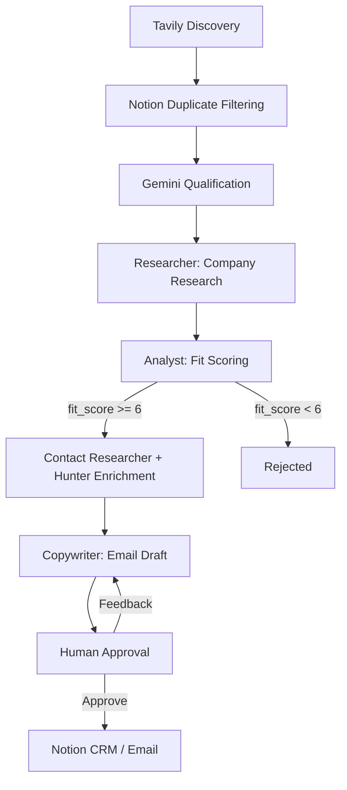

# DealFlow AI

DealFlow AI is a B2B lead-sourcing and outreach application. It discovers
companies that match a target customer profile, filters out companies already
in your Notion CRM, qualifies the remaining candidates, researches each
qualified company, finds a relevant decision maker, and drafts a personalized
outreach email. A human reviews and approves every lead before anything is
written to the CRM or sent by email.

## Overview

Manual B2B prospecting is slow: finding companies, checking whether you already
know them, verifying growth signals, identifying the right contact, and writing
a tailored first-touch email are all separate, tedious steps. DealFlow AI
automates these steps as a pipeline of AI agents, while keeping a human in the
loop for the final decision.

The workflow is web-grounded: every company, contact, and signal is derived
from live search results rather than the model's training data. This reduces
hallucination by making the agents cite evidence they actually saw.

## Key Features

- **Company discovery** via the Tavily search API (with DuckDuckGo fallback).
- **Notion CRM duplicate filtering** so already-known companies are not proposed again.
- **AI qualification** of discovered companies against the target profile using Google Gemini.
- **Multi-query company research** covering profile, news, hiring, leadership, and operations.
- **Contact research** to identify a relevant decision maker from public sources.
- **Hunter.io email enrichment** as an additional verified-email provider.
- **Personalized outreach generation** with an editable draft and natural-language rewrite.
- **Human approval** gate before any CRM write or email send.
- **Notion CRM integration** for saving qualified leads.
- **Gmail/SMTP sending** for the approved email.
- **LangGraph state machine** with SQLite checkpointing for per-company runs.
- **Streamlit UI** with light and dark theme support.

## End-to-End Pipeline

```text
Discovery
   ↓
Notion Duplicate Filtering
   ↓
AI Qualification
   ↓
Company Research
   ↓
Contact Research
   ↓
Hunter Enrichment
   ↓
AI Outreach Generation
   ↓
Human Approval
   ↓
Notion CRM / Email
```

1. **Discovery** — The master agent runs web searches for the target profile and extracts a broad list of candidate companies.
2. **Notion Duplicate Filtering** — The Notion CRM is queried first, and any candidate that matches an existing CRM company is excluded before qualification.
3. **AI Qualification** — Gemini selects the 5–10 candidates that best match the target profile.
4. **Company Research** — Each qualified company is researched with multiple queries (profile, news, hiring, leadership, operations).
5. **Contact Research** — A relevant decision maker is identified from public evidence.
6. **Hunter Enrichment** — Hunter.io is queried for a verified email when a company domain is known.
7. **AI Outreach Generation** — A personalized first-touch email is drafted.
8. **Human Approval** — The run pauses for human review.
9. **Notion CRM / Email** — Only after explicit approval is the lead saved to Notion and/or the email sent.

## Architecture

The project is a small set of focused modules orchestrated by a LangGraph state
machine.

| Module | Responsibility |
| --- | --- |
| `src/app.py` | Streamlit UI: input, approval, CRM/email actions, rewrite. |
| `src/orchestrator.py` | LangGraph pipeline, discovery/qualification, Notion dedup, CRM writes. |
| `src/research.py` | Search providers (Tavily/DDGS), query building, result formatting. |
| `src/hunter.py` | Hunter.io domain email enrichment. |
| `src/prompts.py` | Prompt templates for each agent stage. |
| `src/schemas.py` | Pydantic models for structured LLM output. |
| `src/email_service.py` | SMTP sending via Gmail. |



## Qualification

Each qualified candidate is scored by the Analyst on four dimensions, which sum
to a `fit_score` from 0 to 10:

| Dimension | Range |
| --- | --- |
| ICP fit | 0–3 |
| Business need | 0–3 |
| Recency | 0–2 |
| Signal strength | 0–2 |

A company with a `fit_score` of **6 or higher** is considered qualified and
proceeds to contact research and outreach drafting. Companies below the
threshold are set aside in the "Lower-Fit Leads" section of the UI. The
threshold is the `QUALIFIED_SCORE` constant in `src/orchestrator.py`.

## Human-in-the-Loop Safety

DealFlow AI never acts on a lead automatically:

- Discovered and qualified companies are **not** automatically added to the CRM.
- Emails are **not** sent automatically.
- The graph interrupts before the human-approval stage.
- You review the draft, edit it, or request a **Rewrite** with natural-language feedback.
- CRM writes and email sends happen **only** when you explicitly click the corresponding button after approval.

## Duplicate Prevention

Before qualification, the app reads the Notion CRM and excludes companies that
are already present:

- **Name matching** — company names are normalized (lowercased, punctuation stripped, whitespace collapsed) and compared.
- **Domain matching** — a candidate's website domain is compared against domains extracted from the CRM (from domain-shaped company names and stored contact emails).
- **Pagination** — the CRM is read in pages so the full database is covered.
- **Final safety check** — the qualified result is filtered again against the CRM list.

If the Notion CRM cannot be queried, the batch is skipped (the app returns no
results rather than proposing duplicate companies).

## Technology Stack

- Python 3.10+
- Streamlit
- LangGraph (`langgraph-checkpoint-sqlite`)
- Google Gemini (`langchain-google-genai`)
- Tavily Search API
- Notion API (`notion-client`)
- Hunter.io
- SMTP / Gmail
- SQLite (LangGraph checkpointing)
- Pydantic

## Project Structure

```text
Lead-Getter/
├── src/
│   ├── app.py
│   ├── orchestrator.py
│   ├── research.py
│   ├── hunter.py
│   ├── prompts.py
│   ├── schemas.py
│   └── email_service.py
├── tests/
│   ├── test_notion_dedup.py
│   └── test_rewrite_sync.py
├── .env_example
├── .gitignore
├── .python-version
├── LICENSE
├── pyproject.toml
├── requirements.txt
├── README.md
└── uv.lock
```

## Installation

Requires Python 3.10 or newer.

```bash
python --version
```

Clone the repository and create a virtual environment. Both `uv` and `pip` are
supported.

Using `uv`:

```bash
uv venv
source .venv/bin/activate      # Windows: .venv\Scripts\activate
uv pip install -r requirements.txt
```

Using `pip`:

```bash
python -m venv .venv
source .venv/bin/activate      # Windows: .venv\Scripts\activate
pip install -r requirements.txt
```

## Configuration

Copy the template and fill in your credentials:

```bash
cp .env_example .env
```

The following variables are required:

```env
GOOGLE_API_KEY=your_key_here
TAVILY_API_KEY=your_key_here
HUNTER_API_KEY=your_key_here
NOTION_TOKEN=your_token_here
NOTION_DATABASE_ID=your_database_id_here
sender_email=your_gmail_address@gmail.com
sender_password=your_16_character_app_password
```

| Variable | Purpose |
| --- | --- |
| `GOOGLE_API_KEY` | Gemini API key for reasoning, qualification, and drafting. |
| `TAVILY_API_KEY` | Tavily search API key for web discovery and research. |
| `HUNTER_API_KEY` | Hunter.io key for verified email enrichment (optional, degrades gracefully). |
| `NOTION_TOKEN` | Notion integration token for reading and writing the CRM. |
| `NOTION_DATABASE_ID` | The Notion database used as the CRM. |
| `sender_email` / `sender_password` | Gmail address and app password for SMTP sending. |

The email sender also accepts the uppercase aliases `SENDER_EMAIL` and
`SENDER_PASSWORD`.

## Running the Application

```bash
streamlit run src/app.py
```

Enter a target customer profile, click **Start Batch Sourcing**, review the
qualified leads, and then approve, save, send, or rewrite each one.

## Testing

```bash
python -m compileall src tests
python tests/test_notion_dedup.py
python tests/test_rewrite_sync.py
```

The regression tests cover:

- **Notion duplicate filtering** — the notion-client v3 `data_sources.query` path, fail-safe behavior, and exclusion of existing companies.
- **Rewrite synchronization** — that the rewritten draft is shown in the UI and used by subsequent CRM/email actions.

The Notion test reads configuration from `.env`, so a configured environment is
required to run it.

## Security and Privacy

- Secrets belong in `.env`, which is excluded from Git via `.gitignore`.
- The SQLite checkpoint database (`state.db*`) is also excluded from Git.
- CRM and contact data is not intended to be committed to the repository.
- Emails are sent only after explicit human approval.

## Limitations / Considerations

- Requires valid Gemini, Tavily, and Notion credentials; Hunter and Gmail are needed for enrichment and sending.
- External API availability, quotas, and rate limits can affect throughput.
- LLM output is non-deterministic and can vary between runs.
- Search result quality influences discovery and qualification accuracy.
- Qualification quality depends on the evidence available for a given company.
- Verified contact emails are often unavailable and are left empty rather than guessed.

## License

This project is licensed under the MIT License. See [LICENSE](LICENSE).
